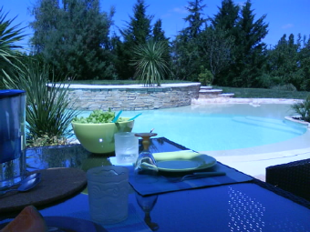
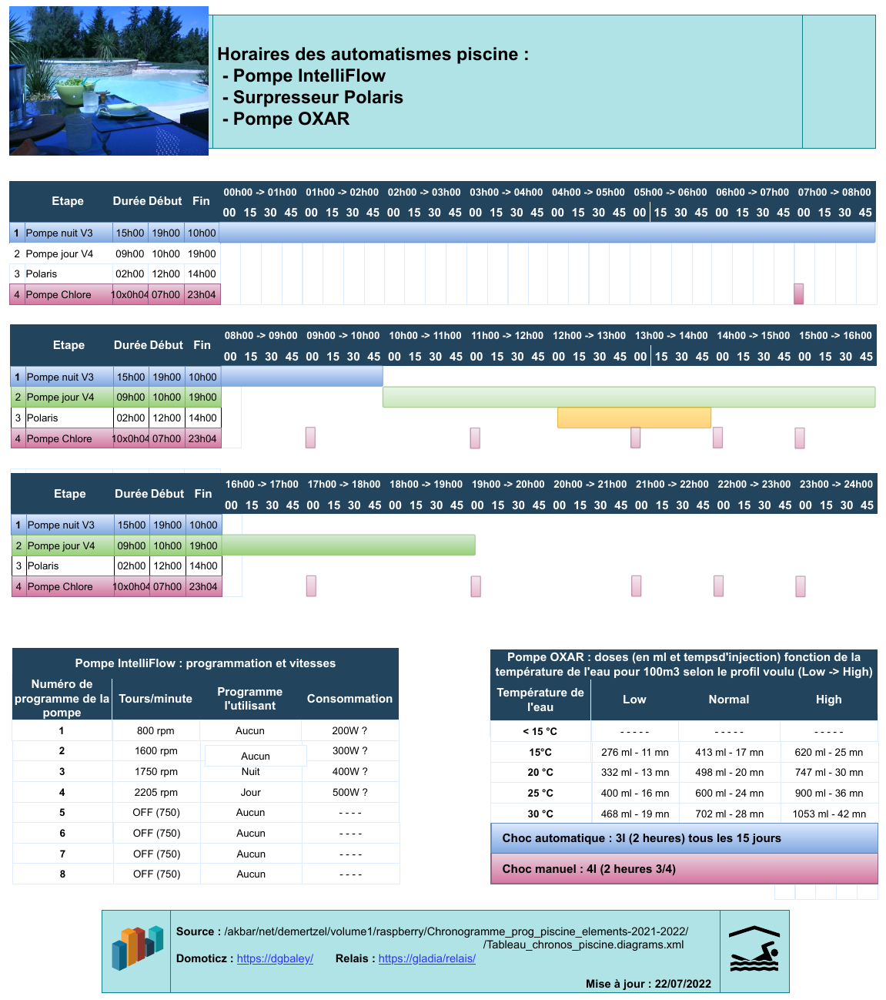

# domhome-piscine-schedules
Gestion des schedules des periphs piscine

https://github.com/jyb/domhome-piscine-schedules.git
(https://github.com/jyb/domhome-piscine-schedules.git)

    cree_schedules.py : creation des schedules piscine (creation de crontabs en attendant mieux)

    JYB - 2023/04/10

## Fonctionnement

Fonction de la temperature piscine (idealement une moyenne de la veille a la meme heure ou a la meme date l'annee d'avant, TBC),
on cree un schedule pour :
   - la pompe principale de la piscine : 4 vitesses (V1 V2 V3 V4) et horloge pour chacune
   - la pompe de Chlore liquide
   - le polaris

Selon la temperature piscine, on a 6 schedules differents pour la pompe principale et le Polaris:

|--------------|-------|------|------|------|------|---------|------------|--------|-------|------------|---------|--------|
| Temp piscine |     horaires start (B) et stop (E) de chaque vitesse (VX) et Polaris, d'apres schema Cathie 2023          |
|--------------|-------|------|------|------|------|---------|------------|--------|-------|------------|---------|--------|
|              | 00:00 | 03:00| 04:00| 06:00| 07:00|  08:00  |   11:30    |  12:00 | 14:00 |     14:30  |  20:00  |  22:00 |
|--------------|-------|------|------|------|------|---------|------------|--------|-------|------------|---------|--------|
|Temp < 10°C   |       |      | B.V1 | E.V1 |      |         |            |        |       |            |         |        |    
|10 < Temp < 12|       |  B.V1|  V1  |   V1 | E.V1 |         |            |        |       |            |         |        |    
|12 < Temp < 16|  B.V1 |  V1  | E.V1 |      |      |         |    B.V4    |  B.Pol | E.Pol |     E.V4   |         |        |
|16 < Temp < 24|       |      |      |      |      |  B.V2   |  E.V2-B.V4 |  B.Pol | E.Pol |  E.V4-B.V3 |   E.V3  |        |
|24 < Temp < 27|       |      |      |      |      |  B.V2   |  E.V2-B.V4 |  B.Pol | E.Pol |  E.V4-B.V3 |         |   E.V3 |
|27 < Temp < 30|       |      | B.V1 |      |      |E.V1-B.V2|  E.V2-B.V4 |  B.Pol | E.Pol |  E.V4-B.V3 |         |   E.V3 |
|--------------|-------|------|------|------|------|---------|------------|--------|-------|------------|---------|--------|

NOTA: 
 - verifier que la pompe principale marche quand on active le Polaris, ou la pompe de chlore liquide 
   (et verifier que le Polaris ne fonctionne pas qd on delivre le chlore)

## Materiel/docs/réglages

### Du cote de la pompe Chlore : SEKO PE 1.5

Pompe péristaltique Seko PE 1.5 l/h (kit WTD) 
(https://www.quimipool.com/fr/817-pompe-peristaltique-seko-pe-15-l-h-kit-wtd.html)

SEKO : Catalogue général : traitement d'eau (PDF) 
(https://cdn.seko.com/s/50959390-4f61-4be9-9fff-92c4da6ad670%2FCatalogue+Ge%CC%81ne%CC%81ral+Traitement+d%27Eau.pdf)

Debit : 1,5l/heure = 25ml/mn

 - la faire tourner qd la pompe piscine fonctionne
 - ne pas la faire tourner qd le polaris fonctionne
 - la faire tourner plutot le matin
Selon temperature et le type de traitement (Low, Medium ou High) on affiche la dose (ml) et le temps (minutes) :

|-------------|----------|----------|----------|
| Température |    Low   |  Medium  |   High   |
|-------------|----------|----------|----------|
|  T < 15°C   |    ---   |   ---    |    ---   |
| 15 < T < 20 | 276 - 11 | 413 - 17 | 620 - 25 |
| 20 < T < 25 | 332 - 13 | 498 - 20 | 747 - 30 |
| 25 < T < 30 | 400 - 16 | 600 - 24 | 900 - 36 |
|  T > 30 °C  | 468 - 19 | 702 - 28 |1053 - 42 |
|-------------|----------|----------|----------|

A propos de la variable schedule :
    Au depart on a une liste de schedules ; chacun est un tableau de dict ;
    chaque dict est un front montant ou descendant applique a un objet a une heure/minutes donnes
    donne ici en hard code, il y a 2 fonctions de chargement ou creation d'un JSON, donc on peut partir d'un JSON externe si besoin
    Normalement ce JSON doit etre deduit d'une requete a la gestion de la pompe piscine et a Domoticz.

  Le pb est qu'il n'y a pas (encore ?) d'interface a la pompe piscine, donc on est obligés de "tricher" :
   - on fait le paramétrage/horloge de la pompe piscine
   - on reporte ce paramétrage sur Domoticz -> interrupteurs/dispositifs virtuels)  
   - on s'appuie sur cette info QUI DOIT RESTER COHERENTE !
   - on applique les lois de 2 tableaux : 
       - tableau des schedules pompes (renseigné à la main ou partiellement via Domoticz)
       - tableau de ce qu'il faut envoyer comme quantité de chlore par jour fonction de la temperature

 

Lancement : 
$ export SCHED_DOMOTICZ_USER=bougon
$ export SCHED_SCRIPTS_DIR=/home/tmp
$ export SCHED_DOMOTICZ_PASSWD=passwd
$ python3 cree_schedules.py
Pas besoin de venv python, pas de modules particuliers

Ex de recup Temp piscine via Domoticz :
TEMP_PISCINE=$(curl -u "bougon:passwd" -s  "http://dgbaley:8080/json.htm?type=devices&rid=108" | jq '.result[0].Data' | sed -e 's/"//g' | awk '{print $1}') ; echo "$TEMP_PISCINE" 

https://pypi.org/project/urllib3/
https://urllib3.readthedocs.io/en/stable/reference/index.html

## Histo

#### Notes de bas de page
Voir https://forge.foundation4flight.solutions/gitlab/Akbar/PhebusGetData/-/blob/master/README.md
